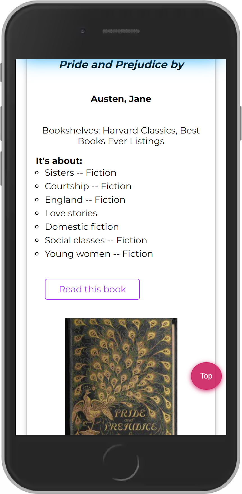
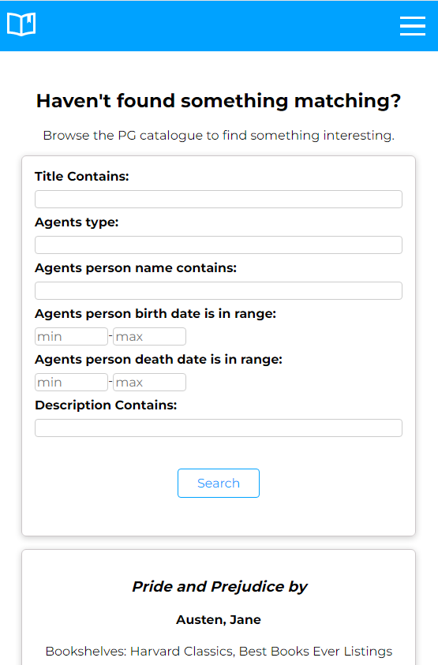

# Book4u

> An app that utilises an API built upon Project Gutenberg's database for browsing PG's catalogue.  
> You can check live demo [_here_](https://book4u-b0a2a.web.app/).

## Table of Contents

- [General Info](#general-information)
- [Technologies Used](#technologies-used)
- [New Features](#new-features)
- [Screenshots](#screenshots)
- [Setup](#setup)
- [Project Status](#project-status)
- [Contact](#contact)

## General Information

- The app uses an API built upon Project Gutenberg's database to provide the user with access to the PG database. Full documentation of the API can be found [here](https://gnikdroy.pythonanywhere.com/docs/).
- At start, the app downloads the list of books available in the database. The user can jump between pages and manually search for something to read or use filters to narrow down the criteria of the books he/she is interested in (e.g., the user can search for the books of a given author or with a certain word in the title).
- When the user finds a book he/she is interested in, it can be marked as a favorite.
- The app enables user to read books online.

## Technologies Used

- [React](https://reactjs.org/blog/2022/03/29/react-v18.html)
- [React-Router](https://github.com/remix-run/react-router)
- [Redux](https://redux.js.org/)
- [Redux Toolkit](https://redux-toolkit.js.org/)
- [Redux Persist](https://www.npmjs.com/package/redux-persist)
- [React Transition Group](https://reactcommunity.org/react-transition-group/)
- [ESLint](https://www.npmjs.com/package/eslint)
- [Prettier](https://www.npmjs.com/package/prettier)

## New Features

Added in vs 1.3

- Navbar show & hide on scroll, which improves the UX on all mobile devices
- Custom scrollbar

Added in vs 1.2

- Smoother animations thanks to the use of the [React Transition Group](https://reactcommunity.org/react-transition-group/).
- Many minor improvements in styling.

Added in vs 1.1

- Added new search criteria that allow narrowing down search results further (e.g., search by book description, download range, and language in which the book was written).
- The list of favorite books is now stored locally, and the user can go back to it even if he/she closes the browser.
- Improved UI:
  - Some of the search options that have fixed values have been replaced by a drop-down list.
  - Animated form with search criteria that appears only on the user's click.
  - Button for deleting all entered search criteria.
  - Counter for monitoring the number of user's favorite books and a button for deleting all at once.
  - The 'jump to top' button and 'jump to the top after load' functionality.
- Fixed issue with pagination input.
- Improved RWD for all devices.
- Improved styling of the whole app.
- And many more smaller improvements.

## Screenshots

You can either choose from books downloaded at the app's start up  


or narrow down criteria to find something specific.  


## Setup

To run this project locally:

1.Clone this repository

```sh
$git clone https://github.com/noszczykmichal/book4u
```

2.Go into the repository

```sh
$cd book4u
```

3.Install dependencies

```sh
$npm install
```

4.Start the development server

```sh
$npm start
```

## Project Status

The project is finished, but from time to time, I might add some new features.

## Contact

Created by [@noszczykmichal](https://michalnoszczyk.com/) - feel free to contact me!
