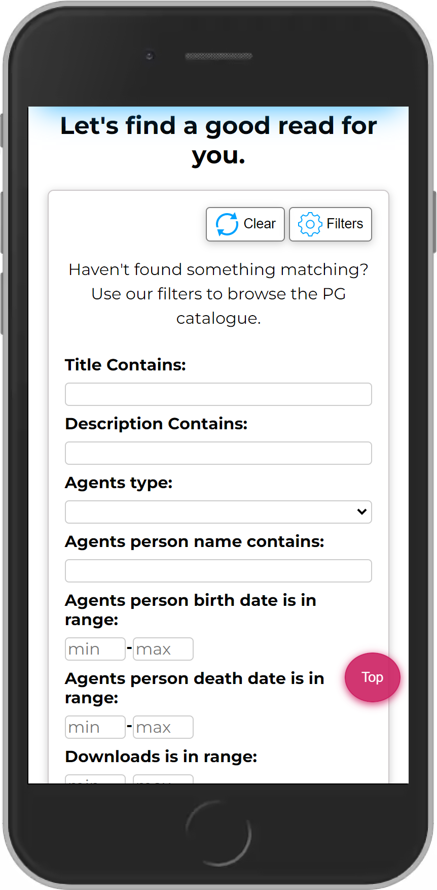

# Book4u

> An app using the Project Gutenberg's API for browsing PG catalogue.    
> You can check live demo [_here_](https://books-search-app-a9b46.web.app/).

## Table of Contents

* [General Info](#general-information)
* [Technologies Used](#technologies-used)
* [New Features add in vs 1.1](#new-features-add-in-vs-11)
* [Screenshots](#screenshots)
* [Setup](#setup)
* [Project Status](#project-status)
* [Contact](#contact)


## General Information

- The app uses Project Gutenberg's API to provide the user with access to PG's database - full documentation of the API can be found [here](https://gnikdroy.pythonanywhere.com/docs/).
- At start the app downloads the list of books available in the database. The user can jump between pages and manually search for something to read or use filters to narrow down the criteria of the books he/she is interested in (e.g user can search for the books of given author, or having certain word in a title).
- When user finds book he/she is interested in, it can be marked as a favorite one.
- The app enables user to read books online.


## Technologies Used

- [React 18](https://reactjs.org/blog/2022/03/29/react-v18.html)
- [React-DOM](https://www.npmjs.com/package/react-dom)
- [React-Router](https://github.com/remix-run/react-router)
- [React Hooks](https://reactjs.org/docs/hooks-intro.html)

## New Features added in vs 1.1

- added new search criteria which allow to narrow down search results further (e.g. search by description of a book, download range and language in which book was written)
- list of favorite books is now stored locally and the user can go back to it even if he/she closes a browser
- improved UI: 
    * some of the search options that have fixed values have been replaced by a drop-down list
    * animated form with search criteria that appears only on user's click
    * button for deleting all entered search criteria
    * counter for monitoring number of user's favorite books and button for deleting all at once
    * the 'jump to top' button and 'jump to the top after load' functionality
- fixed issue with pagination input  
- improved RWD for all devices
- improved styling of the whole app
- and many more smaller improvements


## Screenshots

You can either choose from books downloaded at the app's start up.


or narrow down criteria to find something specific.


## Setup

To run this project locally:
```
#Clone this repository
$git clone https://github.com/noszczykmichal/books-search-app
#Go into the repository
$cd books-search-app
#Install dependencies
$npm install
#Run the app
$npm start
```

## Project Status

The project is finished yet from time to time I might add some new features.


## Contact

Created by [@noszczykmichal](https://noszczykmichal.github.io/portfolio/index.html#contact) - feel free to contact me!